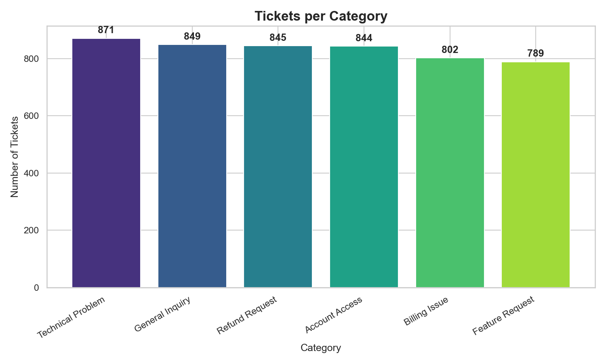
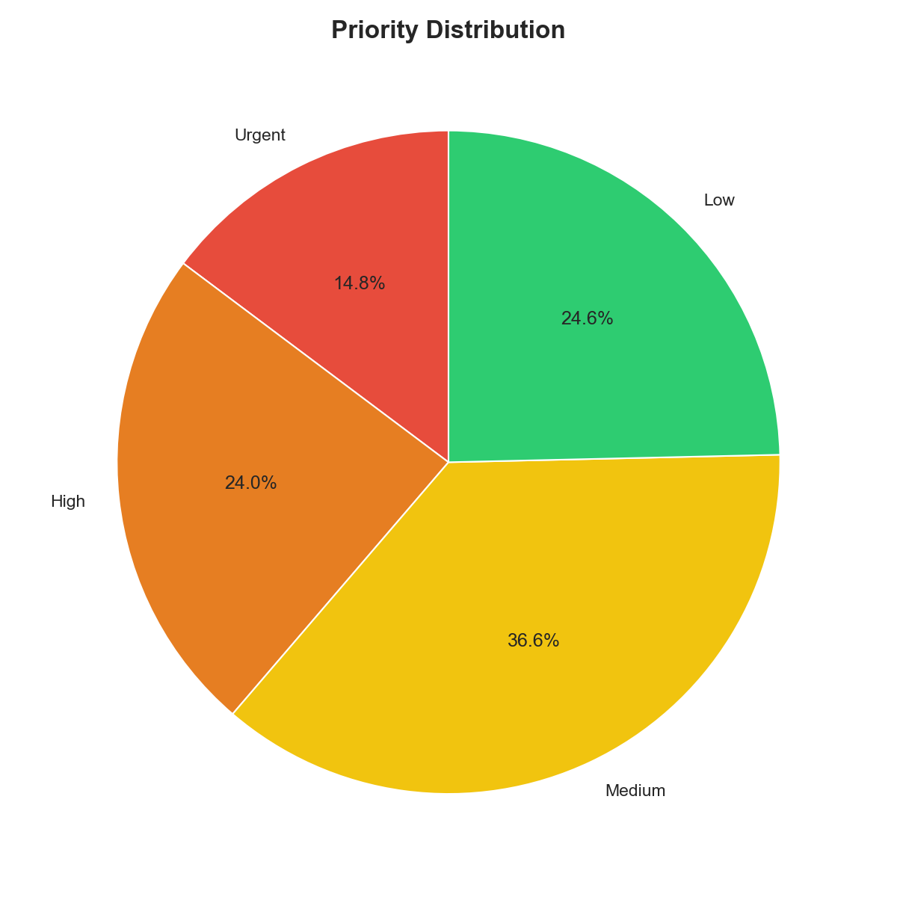
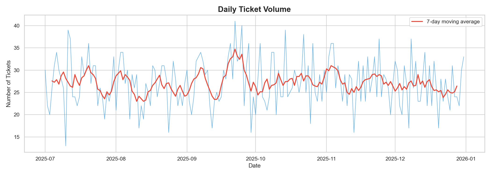
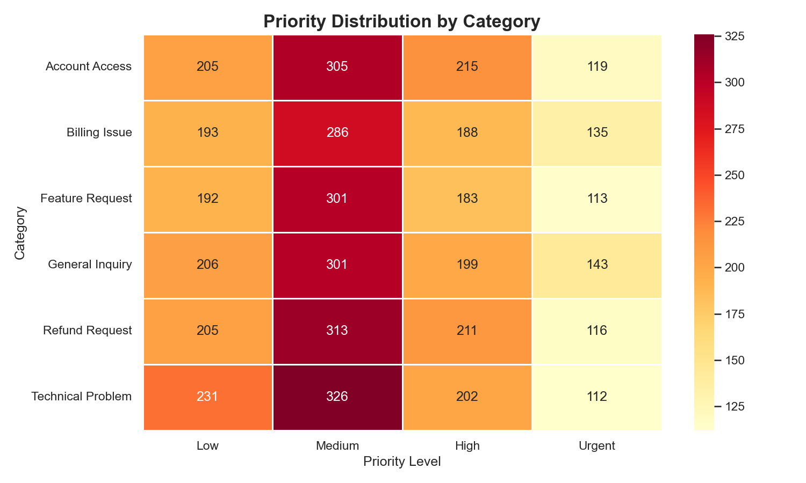
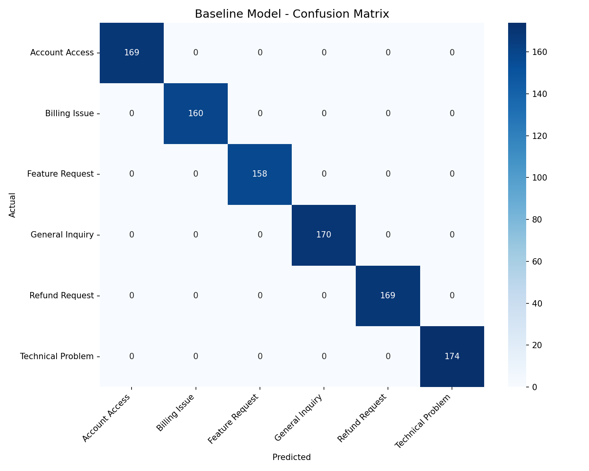

# AI Customer Support Ticket Classification & Auto-Reply System

A production-ready ML system that automatically classifies customer support tickets, predicts priority levels, and generates intelligent auto-replies -- all running locally on CPU without any paid APIs.


---

## Architecture

```
+-------------------------------------------------------------+
|                    FastAPI REST Service                       |
|                                                              |
|  POST /predict   ->  Category + Priority + Auto-Reply        |
|  GET  /health    ->  System health check                     |
|  GET  /analytics ->  Prediction analytics                    |
|  GET  /history   ->  Recent predictions                      |
+--------------------------------------------------------------+
|                     ML Pipeline                               |
|                                                              |
|  +------------------+  +------------------+                  |
|  | Category Model   |  | Priority Model   |                  |
|  | TF-IDF + LogReg  |  | TF-IDF + RF      |                  |
|  +------------------+  +------------------+                  |
|                                                              |
|  +------------------+  +------------------+                  |
|  | Transformer      |  | Reply Generator  |                  |
|  | DistilBERT       |  | Template-Based   |                  |
|  +------------------+  +------------------+                  |
+--------------------------------------------------------------+
|  SQLite DB  |  Analytics Engine  |  Synthetic Dataset         |
+--------------------------------------------------------------+
```

---

## Analytics & Visualizations

### Tickets per Category


### Priority Distribution


### Daily Ticket Volume


### Priority by Category Heatmap


### Baseline Model - Confusion Matrix


---

## Project Structure

```
├── data/
│   ├── generate_dataset.py      # Synthetic data generator (5K tickets)
│   ├── tickets.csv              # Generated dataset
│   └── analytics_export.csv     # Power BI export
├── models/
│   ├── train_baseline.py        # TF-IDF + Logistic Regression
│   ├── train_transformer.py     # DistilBERT fine-tuning
│   ├── train_priority.py        # Random Forest priority model
│   └── saved/                   # Trained model artifacts
├── api/
│   └── main.py                  # FastAPI REST service
├── utils/
│   ├── preprocessing.py         # Text cleaning pipeline
│   ├── data_loader.py           # Dataset loading & splitting
│   ├── reply_generator.py       # Template-based auto-reply
│   ├── analytics.py             # Analytics & visualization
│   └── database.py              # SQLite prediction logging
├── images/                      # Charts for README
├── notebooks/                   # Jupyter exploration (optional)
├── requirements.txt
└── README.md
```

---

## Quick Start

### 1. Install Dependencies

```bash
pip install -r requirements.txt
```

### 2. Generate Dataset

```bash
python data/generate_dataset.py
```

This creates `data/tickets.csv` with 5,000 synthetic support tickets across 6 categories.

### 3. Train Models

```bash
# Baseline category classifier (fast -- ~10 seconds)
python models/train_baseline.py

# Priority prediction model (fast -- ~15 seconds)
python models/train_priority.py

# Transformer model (optional -- slow on CPU, ~30-60 min)
python models/train_transformer.py
```

### 4. Generate Analytics

```bash
python utils/analytics.py
```

Produces charts and exports `data/analytics_export.csv` for Power BI.

### 5. Start API Server

```bash
uvicorn api.main:app --reload --port 8000
```

### 6. Test API

```bash
# Health check
curl http://localhost:8000/health

# Classify a ticket
curl -X POST http://localhost:8000/predict \
  -H "Content-Type: application/json" \
  -d '{"text": "I was charged $49.99 twice for my subscription"}'
```

Or visit **http://localhost:8000/docs** for the interactive Swagger UI.

---

## Models

| Model | Task | Algorithm | Speed |
|-------|------|-----------|-------|
| **Baseline** | Category Classification | TF-IDF + Logistic Regression | Fast (10s train) |
| **Transformer** | Category Classification | DistilBERT Fine-tuned | Slow (30-60min CPU) |
| **Priority** | Priority Prediction | TF-IDF + Random Forest | Fast (15s train) |
| **Reply** | Auto-Reply Generation | Template + Rule-Based | Instant |

### Categories
- Billing Issue
- Technical Problem
- Account Access
- Refund Request
- Feature Request
- General Inquiry

### Priority Levels
- Low -> Medium -> High -> Urgent

---

## API Endpoints

| Method | Endpoint | Description |
|--------|----------|-------------|
| `POST` | `/predict` | Classify ticket + predict priority + generate reply |
| `GET` | `/health` | System health and model status |
| `GET` | `/analytics` | Aggregate prediction analytics |
| `GET` | `/history` | Recent prediction history |

### Example Response

```json
{
  "category": "Billing Issue",
  "priority": "High",
  "reply": "Dear Customer, Thank you for reaching out regarding your billing concern...",
  "timestamp": "2025-07-15T10:30:00"
}
```

---

## Power BI Integration

The `data/analytics_export.csv` includes:
- All ticket fields
- Numeric priority (1-4) for calculations
- Day of week and month for time analysis
- Ready to import directly into Power BI / Tableau / Excel

---

## Tech Stack

- **Python 3.9+**
- **scikit-learn** -- TF-IDF, Logistic Regression, Random Forest
- **HuggingFace Transformers** -- DistilBERT fine-tuning
- **FastAPI** -- REST API framework
- **SQLite** -- Prediction logging database
- **Pandas / NumPy** -- Data processing
- **Matplotlib / Seaborn** -- Visualization
- **NLTK** -- Text preprocessing

---

## License

This project is for educational and portfolio purposes.
